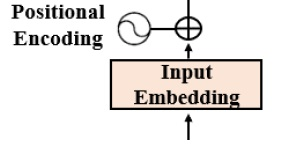

# Transformers

The original structure has **6 layers** and each layer contains **sublayers**. So in general there are 6 layers in the **encoder** stack and other 6 in the **decoder** stack. But don't worry we will mention what means these concepts


As you can see above there is no RNN, LSTM or CNN arquitecture and thats because recurrence is no longer important in this type of arquitecture

The `attention mechanism` is a `word-to-word` operation (in reality is `token-to-token` but let's keep it simple). And this `attention mechanism` determines how each word is related to all other words in a sequence including the word analyzed.

**Example**
Let's use the following sentence

*The cat sat on the mat*

When we refer to `attention` means that we will run dot products between word vectors and therefore determine what are the strongest relationships between a given word and all the other words including itself (e.g sat and sat)


Therefore the `attention mechanism` provide a deeper relationship between words. For each attention sublayer the original model runs 8 attention mechanisms in parallel to speed up calculations, thats called `multi-head attention`.

Some benefits of this are:
1. A complete analysis of sequences
2. Avoid recurrence which reduce calculation operations
3. Parallelization reducing training time
4. Each attention mechanism learns different perspectives of the same input sequence

# Encoder Stack (general description)
The encoder stack has $N=6$ layers and each layer hasta the following structure:


Each layer contains two main sublayers
- A multi-headed attention mechanism
- Fully connected position-wise feedforward network

Each sublayer is surround by a residual connection. These connections transport unprocessed input $x$ of a sublayer to a layer normalization function. Therefore the normalized output of each layer is:

$$LayerNormalization(x+Sublayer(x))$$

The structure of the N=6 layers is identical but the content is different since there are different weights. The only exception is the first layer which includes the `embedding layer` at the bottom, the others 5 layers not conatin this (beacuse the encoded input can't change). 

Take in count that although all the multi-head attention mechanisms perform the same functions they do not perform the same tasks. The reason is because each leayer learns from previous layers checking different ways of associating the tokens in the sequence

To avoid problems of dimensionality we can set a dimension size to represent tokens, a constant for a given model for example in the original Transformer model $d_{model} = 512$

# 1. Encoder - Input Embedding

this sublayer converts the input tokens to vectors of dimension $d_{model}= 512$ or to the specified size of the model from past learning.


The `tokenizer` will transform the sentence into `tokens`. Each `tokenizer` has own methods such as `Byte Pair Encoding (BPE)`, word piece and sentence piece methods. The original Transformer uses BPE but other models use different mehtods

You can test it out in OpenAI [Tokenizer openAI](https://platform.openai.com/tokenizer) you can put the following sentence *the Transformer is an innovative NLP model!* and you will get this:


As you can see there are 9 tokens and 43 characters. You must know that usually each word is represented by an integer in the tokenizer.

Additionally each word is represented by a $d_{model}=512$ dimensions, for example:

```bash
curl https://api.openai.com/v1/embeddings   -H "Content-Type: application/json"   -H "Authorization: Bearer sk-XXXXXXXX"   -d '{
    "input": "The black cat sat on the couch and the brown dog slept on the couch",
    "model": "text-embedding-3-small"
  }'

```

You can also test it with the files `input_embedding.py` or `input_embedding_node.js` if you prefer Python or NodeJS. The output will be something like this for the phrase (Note: ensure that you have an `OPENAI_API_KEY` in a `.env` file to avoid issues):

```python 
array=[-0.027019580826163292, -0.03926384449005127, -0.03197353333234787, 0.007338985800743103, 0.037857700139284134, ......, -0.03318497911095619, 0.01930742710828781]
```

You can also obtain a similar representation for each word. And we can also check if two words are similar or not. For example que can check if the words `king` and `queen` are similar using the Cosine distance metric. You can run the `cosine_similarity.py` or `cosine_similarity_node.js` as you prefer to get the ouput.

*Cosine similarity between 'king' and 'queen': 0.5905304590968364*

So therefore we can conclude that the input to the Transformers arquitecture is not just simple numbers. Models have learned word word embeddings that already provide information regarding words association. However there is no context about the position of each word in the sequence. In order to solve this the next structure is vital the `positional encoding`

# 2 Encoder - Positional Embedding

When we go out from the input embedding we have a sequence of vectors of dimension $d_{model}=512$. However we need to know the position of each word in the sequence and that's the `Input Embedding` purpose. the main idea is add a positional enocding vlaue to the input embedding instead of having additional vectors to describe the position of a token in a sequence.



Basically the idea is add a value to the word embedding of each word so that is has that information. In that case we need to add a value to the $d_{model}=512$ dimensions. For each word embedding vector we need to find a way to provide information $j$ in the `range(0,512)` dimensions of the word embedding vector of each word.

You need to take in count that there are different ways to do this, one technique is the unit sphere with sine and cosine values. Vawani et al. (2017) provide the following functions to generate different frequencies for the **positional encoding(PE)** for each position and each dimension $j$ of the $d_{model}=512$ of the word embedding vector

$$PE_{pos_{2j}}= sin(\frac{pos}{10000^{\frac{2j}{d_{model}}}})$$

$$PE_{pos_{2j+1}}= cos(\frac{pos}{10000^{\frac{2j}{d_{model}}}})$$

The sine function will be applied to the even numbers and the cosine to the odd numbers. Some other cases do it differently. In our case the domain of the sine function is $j \in [0,255]$ and for the cosine function is $j \in [256,512]$

The function provided by Vaswani et al. (2017) is given by:

```python
def positional_encoding(pos,pe):
  for i in range(0, 512,2):
    pe[0][i] = math.sin(pos / (10000 ** ((2 * i)/d_model)
    pe[0][i+1] = math.cos(pos / (10000 ** ((2 * i)/d_model
return pe
```
You can check how it looks the plot in `positional_encoding_simple.py` or `positional_encoding_simple.js`

Lets take an example for the phrase: 
*The black cat sat on the couch and the brown dog slept on the rug*

If we implement the  positional encoding to the `pos= 2` and `pos=10` for the words **black** and **brown** respectively we got the following results (check `positional_encoding_simple_2.py` or `positional_encoding_simple_2.js`):

```python
PE(2)=[[ 9.09297427e-01 -4.16146837e-01  9.58144376e-01 -2.86285442e-01
   9.87046251e-01 -1.60435961e-01  9.99164200e-01 -4.08766567e-02
   9.97479998e-01  7.09482514e-02  9.84702998e-01  1.74241229e-01
   9.63226623e-01  2.68690292e-01  9.35118300 ..............
   2.66704286e-08  1.00000000e+00  2.48187552e-08  1.00000000e+00
   2.30956397e-08  1.00000000e+00  2.14921566e-08  1.00000000e+00]]
```

And 
```python
PE(10)=[[-5.44021111e-01 -8.39071529e-01  1.18776483e-01 -9.92921018e-01
   6.92634182e-01 -7.21289047e-01  9.79174779e-01 -2.03019092e-01
   9.37632744e-01  3.47627440e-01  6.40478017e-01  7.67976503e-01
   2.09077004e-01  9.77899180e-01 -2.37917679e-01 ..............
   2.66704286e-08  1.00000000e+00  2.48187552e-08  1.00000000e+00
   2.30956397e-08  1.00000000e+00  2.14921566e-08  1.00000000e+00]]
```

You will see that if you calculate the cosine similarity between `pos(2)` and `pos(10)` you will get (check `positional_encoding_similarity_2.py` or `positional_encoding_similarity_2.js`): 
```python
cosine_similarity(pos(2), pos(10))= [[0.8600013]]
```

But if you calculate the cosine similarity using the OpenAI model **text-embedding-3-small** you got a different result (check `positional_encoding_similarity_1.py` or `positional_encoding_similarity_1.js`): 

```python
cosine_similarity(black, brown)= [[0.56902884]]
```
So therefore with these examples you will notice that the positional encoding is crucial for incorporating the notion of word order and distance into the model's understanding of the input sequence (an unique representation for each position in the input sequence). It ensures that the model can differentiate between words based not only on their content but also on their position in the sequence.

Now the big question is **How we add positional encoding to the embedding vector?**. Let's see it.